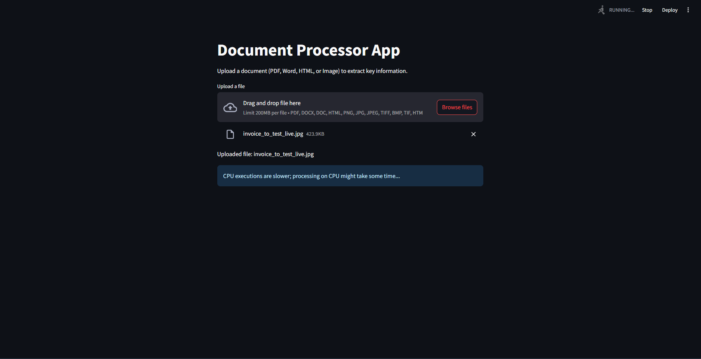
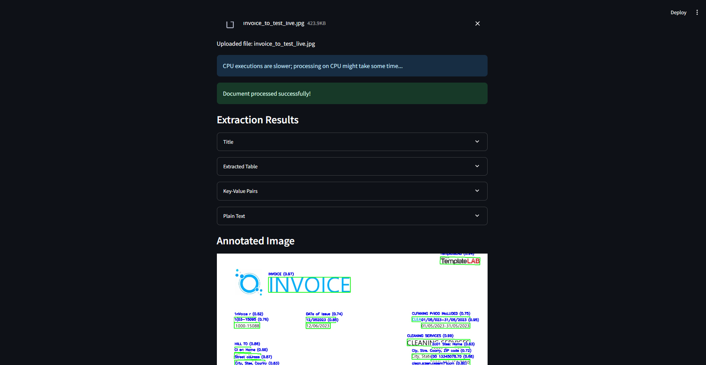
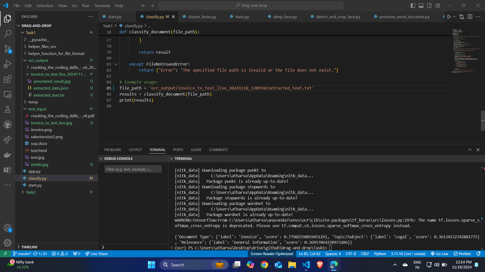
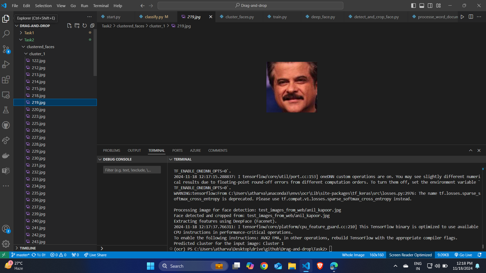

# OCR and Face Clustering Project

## Overview  
This repository contains two distinct tasks demonstrating the use of machine learning for OCR and facial clustering.

1. **OCR (Optical Character Recognition)**  
   Extracts structured information such as titles, key-value pairs, tables, and plain text from diverse document formats (HTML, Word, scanned documents, images, and text files) using **PaddleOCR**.  
   The extracted text is classified into categories such as *Legal*, *Medical*, and *Educational* using a zero-shot classification model.

2. **Facial Clustering**  
   A K-Means clustering model is trained using **FaceNet** to group human faces into clusters based on similarity. A pre-trained model is saved in a `.pkl` file for future testing. The dataset used includes images of celebrities.

---

## Task 1: OCR Document Extraction and Classification

### Features:  
- Extracted structured data includes:  
  - **Title**  
  - **Key-Value Pairs**  
  - **Tables**  
  - **Plain Text**

- **Classification**:  
  The extracted text is classified into the following categories:  
  - Legal  
  - Medical  
  - Educational  

### Outputs:
1. **Streamlit App**:  
   - An interactive interface where users can upload an image or document.  
   - The app processes and attempts to extract **key-value pairs**, **table data**, **titles**, and **plain text**.  
   

2. **Extracted Data Display**:  
   - Displays the extracted information directly in the Streamlit app after processing the uploaded document.  
   

3. **Classification Task**:  
   - Extracted text is passed to a zero-shot detection model to classify the document based on the following labels:  
     - **Type Labels**: Invoice, Contract, Resume, Research Paper  
     - **Topic Labels**: Finance, Legal, Medical, Education  
     - **Relevance Labels**: Priority, Sensitive, General Information  
   

**Note**:  
The OCR model works well but is not fully accurate and will require iterations, including retraining models from scratch, to improve performance.

### Video Demos:  
- **OCR Task**: Demonstration of text extraction from documents:  
  [Watch OCR Demo](https://drive.google.com/file/d/1aOz6URihUtgtxNkJF5flmWDEVfa2tuCf/view?usp=drive_link)  

- **Classification Task**: Demonstration of text classification into predefined categories:  
  [Watch Classification Demo](https://drive.google.com/file/d/1Th4SJ4sIj7D_pN2EYzP3PxIYJ8LY0_Vo/view?usp=drive_link)

---

## Task 2: Facial Clustering with K-Means and FaceNet  

### Features:  
- **Model**: K-Means clustering algorithm.  
- **Embedding**: Used **FaceNet** embeddings for similarity-based clustering.  
- **Dataset**: 4 celebrity face images.  
- **Output**:  
  - The trained model is saved in a `.pkl` file for future testing.  

### Output and Testing:  
1. **Cluster Assignment**:  
   When tested on a random image of Anil Kapoor from the web, the `test_model.py` script correctly predicted that the image belongs to **Cluster 1**, which represents Anil Kapoor.  
   

2. **Missed Predictions**:  
   - An image of Salman Khan with a patchy beard was misclassified into Anil Kapoor's cluster due to inconsistencies in the dataset, as the image looked visually similar.  
   - Improving dataset quality and ensuring consistent preprocessing is crucial to reducing such errors.  

---

### Video Demo:
- **Facial Clustering Task**: Demonstration of training and testing the K-Means clustering model:  
  [Watch Facial Clustering Demo](https://drive.google.com/file/d/1wyJ3oarfdOefrPDOO05KolXafurWG5oB/view?usp=drive_link)

---

